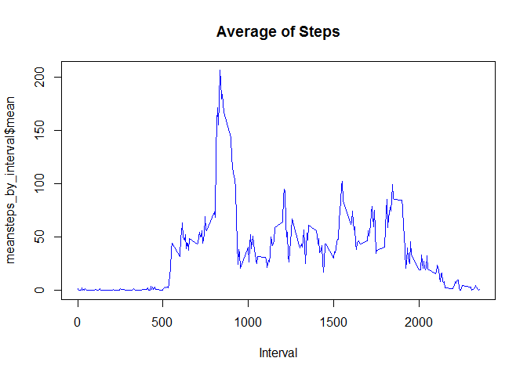
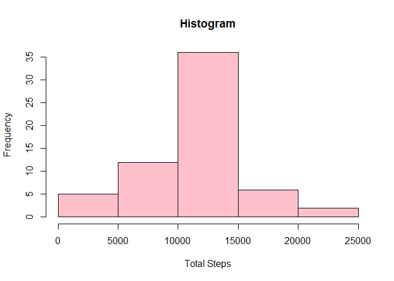

##Loading and preping the data

1.Load the data


```r
activitydata<- read.csv('activity.csv')
```

2. Process/transform the data (if necessary) into a format suitable for your analysis


```r
activitydata$date<-as.Date(activitydata$date)
```


## What is mean total number of steps taken per day?
For this part we are going to exclude the 'NA' values

1. Calculate the total number of steps taken per day


```r
# excluding the 'NA' values
activitydata_clean<- activitydata[!is.na(activitydata$steps),]

# grouping the data by Date
library (dplyr)
```

```
## Warning: package 'dplyr' was built under R version 3.3.3
```

```
## 
## Attaching package: 'dplyr'
```

```
## The following objects are masked from 'package:stats':
## 
##     filter, lag
```

```
## The following objects are masked from 'package:base':
## 
##     intersect, setdiff, setequal, union
```

```r
activitydata_bydate<- group_by(activitydata_clean, date)

# summing up the steps

steps_by_day<- summarise(activitydata_bydate, Total_steps= sum(steps))
```

2. If you do not understand the difference between a histogram and barplot, research the difference between them. Make a histogram of total number of steps taken each day


```r
hist(steps_by_day$Total_steps, xlab='Total Steps', main= 'Histogram', col="pink")
```

<!-- -->

3. Calculate and report the mean and median of total number of steps taken per day


```r
# mean
mean(steps_by_day$Total_steps)
```

```
## [1] 10766.19
```

```r
# median
median(steps_by_day$Total_steps)
```

```
## [1] 10765
```


## What is the average daily activity pattern?

1. Make a time series plot (i.e. type = "l") of the 5-minute interval (x-axis) and the average number of steps taken, averaged across all days (y-axis)


```r
#gourping the data by interval
activitydata_byinterval<- group_by(activitydata_clean, interval)

#calculating the average by interval
meansteps_by_interval<- summarize(activitydata_byinterval, mean= mean(steps))

#ploting the average by interval
plot(meansteps_by_interval$interval, meansteps_by_interval$mean, type= "l", xlab = "Interval", main="Average of Steps", col="blue")
```

<!-- -->

2. Which 5-minute interval, on average across all the days in the dataset, contains the maximum number of steps?


```r
 filter(meansteps_by_interval, mean==max(mean))
```

```
## Warning: package 'bindrcpp' was built under R version 3.3.3
```

```
## # A tibble: 1 x 2
##   interval  mean
##      <int> <dbl>
## 1      835  206.
```


## Imputing missing values

1. Calculate and report the total number of missing values in the dataset (i.e. the total number of rows with NAs)


```r
sum(is.na(activitydata$steps))
```

```
## [1] 2304
```

2. Devise a strategy for filling in all of the missing values in the dataset. The strategy does not need to be sophisticated. For example, you could use the mean/median for that day, or the mean for that 5-minute interval, etc.


```r
# creating a new dataset merged with the average
activitydata_mean<- merge(activitydata, meansteps_by_interval)
# creating a new column using the average by interval to replace the NAs
activitydata_mean$steps<-ifelse(is.na(activitydata_mean$steps), activitydata_mean$mean, activitydata_mean$steps)
```

3. Create a new dataset that is equal to the original dataset but with the missing data filled in.


```r
cleandata<- select(activitydata_mean, steps, date, interval)
```

4. Make a histogram of the total number of steps taken each day and Calculate and report the mean and median total number of steps taken per day. Do these values differ from the estimates from the first part of the assignment? What is the impact of imputing missing data on the estimates of the total daily number of steps?


```r
# grouping the data by Date
cleandata_bydate<- group_by(cleandata, date)

# summing up the steps

steps_by_day02<- summarise(cleandata_bydate, Total_steps= sum(steps))

#plotting the histogram

hist(steps_by_day02$Total_steps, xlab='Total Steps', main= 'Histogram', col="pink")
```

<!-- -->

```r
# mean
mean(steps_by_day02$Total_steps)
```

```
## [1] 10766.19
```

```r
# median
median(steps_by_day02$Total_steps)
```

```
## [1] 10766.19
```

## Are there differences in activity patterns between weekdays and weekends?

1. Create a new factor variable in the dataset with two levels - "weekday" and "weekend" indicating whether a given date is a weekday or weekend day.


```r
day <- weekdays(cleandata$date)
```

2. Make a panel plot containing a time series plot (i.e. type = "l") of the 5-minute interval (x-axis) and the average number of steps taken, averaged across all weekday days or weekend days (y-axis). See the README file in the GitHub repository to see an example of what this plot should look like using simulated data.


```r
daylevel <- vector()
for (i in 1:nrow(cleandata)) {
    if (day[i] == "Saturday") {
        daylevel[i] <- "Weekend"
    } else if (day[i] == "Sunday") {
        daylevel[i] <- "Weekend"
    } else {
        daylevel[i] <- "Weekday"
    }
}
cleandata$daylevel <- daylevel
cleandata$daylevel <- factor(cleandata$daylevel)

library(lattice)

stepsByDay <- aggregate(steps ~ interval + daylevel, data = cleandata, mean)
names(stepsByDay) <- c("interval", "daylevel", "steps")

xyplot(steps ~ interval | daylevel, stepsByDay, type = "l", layout = c(1, 2), 
    xlab = "Interval", ylab = "Number of steps")
```

<!-- -->
